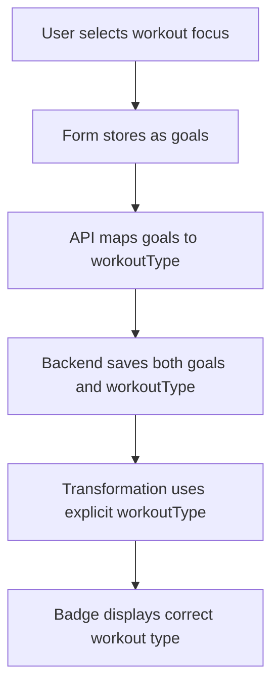

# Workout Type Badge Investigation Report

## Issue Summary

**Problem**: The workout type badge next to the fitness level displays "General" instead of the actual workout type derived from the user's workout generator selections.

**Root Cause**: There's a disconnect between the "Fitness Goal" question in the workout generator and how that data gets mapped to the `workoutType` field displayed in badges.

## Investigation Findings

### 1. **Workout Generator Question Analysis**

**Current Question**: `"What is your fitness goal?"`
**Location**: `src/features/workout-generator/components/Form/steps/InputStep.tsx:158`

```typescript
<label htmlFor="goals" className="input-step__label">
  What is your fitness goal?
  {hasFieldError('goals') && (
    <span className="input-step__error">{getFieldError('goals')}</span>
  )}
</label>
```

**Available Options** (defined at line 38):
```typescript
const GOAL_OPTIONS = [
  { value: 'lose-weight', label: 'Lose Weight' },
  { value: 'build-muscle', label: 'Build Muscle' },
  { value: 'improve-endurance', label: 'Improve Endurance' },
  { value: 'increase-strength', label: 'Increase Strength' },
  { value: 'enhance-flexibility', label: 'Enhance Flexibility' },
  { value: 'general-fitness', label: 'General Fitness' },
  { value: 'sport-specific', label: 'Sport-Specific Training' }
];
```

### 2. **Data Flow Analysis**

#### **Step 1: Form Submission**
- User selects goal → stored as `formValues.goals` (string)
- Data flows through `WorkoutFormParams.goals` (single string value)
- Gets sent to API as `goals: string` in request payload

#### **Step 2: Backend Processing**
**File**: `src/php/API/WorkoutEndpoints/GenerateEndpoint.php:103-130`

```php
$generation_params = [
    'duration'        => $params['duration'] ?? 30,
    'difficulty'      => $params['difficulty'] ?? 'intermediate', 
    'equipment'       => $params['equipment'] ?? [],
    'goals'           => $params['goals'] ?? 'general fitness', // ⚠️ Saved as goals
    'restrictions'    => $params['restrictions'] ?? '',
    'specific_request' => $params['specific_request'],
];
```

- Goals are stored in `_workout_goals` meta field
- **NO explicit workoutType field is set during generation**
- The `workoutType` field is never populated during the generation process

#### **Step 3: Data Retrieval & Transformation**
**File**: `src/dashboard/components/SavedWorkoutsTab/services/workoutData/WorkoutTransformer.ts:100-105`

```typescript
// Extract equipment from exercises if not provided
const equipment = workout.equipment || this.extractEquipmentFromExercises(exercises);

// Determine workout type from exercises or use default
const workoutType = workout.workoutType || this.deriveWorkoutTypeFromExercises(exercises);
```

**Problem**: Since `workout.workoutType` is never set, it falls back to `deriveWorkoutTypeFromExercises()` which returns "General" by default.

#### **Step 4: Workout Type Derivation Logic**
**File**: `src/dashboard/components/SavedWorkoutsTab/services/workoutData/WorkoutTransformer.ts:179-206`

```typescript
static deriveWorkoutTypeFromExercises(exercises: any[]): string {
  if (!Array.isArray(exercises) || exercises.length === 0) return 'General';
  
  try {
    // Simple heuristic based on exercise names
    const exerciseNames = exercises
      .map(ex => ex && ex.name && typeof ex.name === 'string' ? ex.name.toLowerCase() : '')
      .filter(name => name.length > 0)
      .join(' ');
    
    if (exerciseNames.includes('cardio') || exerciseNames.includes('running') || exerciseNames.includes('cycling')) {
      return 'Cardio';
    }
    if (exerciseNames.includes('strength') || exerciseNames.includes('weights') || exerciseNames.includes('lifting') || 
        exerciseNames.includes('bench press') || exerciseNames.includes('squats') || exerciseNames.includes('press')) {
      return 'Strength';
    }
    if (exerciseNames.includes('yoga') || exerciseNames.includes('stretch')) {
      return 'Flexibility';
    }
  } catch (error) {
    console.warn('Error deriving workout type:', error);
  }
  
  return 'General'; // ⚠️ Default fallback - this is what's being displayed
}
```

#### **Step 5: Badge Display**
**File**: `src/dashboard/components/SavedWorkoutsTab/components/Cards/shared/CardMeta.tsx:77`

```typescript
<span className="workout-type-badge">
  {workout.workoutType} // ⚠️ Displays "General" from transformation
</span>
```

### 3. **Architectural Problems Identified**

#### **Problem 1: Missing Goals-to-WorkoutType Mapping**
- User's `goals` selection is stored but never mapped to `workoutType`
- No transformation exists between goal values and workout type categories
- The system relies on exercise name heuristics instead of user intent

#### **Problem 2: Question Terminology Mismatch**
The current question asks about "fitness goal" but should ask about "workout focus" to properly map to workout types:

| Current Goals | Should Map To WorkoutType |
|---------------|---------------------------|
| `lose-weight` | Could be `Cardio` or `HIIT` |
| `build-muscle` | Should be `Strength` |
| `improve-endurance` | Should be `Cardio` |
| `increase-strength` | Should be `Strength` |
| `enhance-flexibility` | Should be `Flexibility` or `Yoga` |
| `general-fitness` | Could be `General` or `HIIT` |
| `sport-specific` | Could be `Sports` |

#### **Problem 3: Incomplete Data Architecture**
- Frontend types expect `workoutType: string` but backend never populates it
- Transformation layer tries to derive workoutType from exercises instead of user intent
- No explicit mapping service between goals and workout types

### 4. **Proposed Question Update**

**Current Question**: `"What is your fitness goal?"`
**Proposed Question**: `"What is the focus of your workout today?"`

**Rationale**: 
- "Focus" better represents what type of workout the user wants to do
- Maps more directly to workout type categories
- Aligns with the badge display purpose (showing workout type, not long-term goal)

### 5. **Required Architectural Fixes**

#### **Fix 1: Add Goals-to-WorkoutType Mapping Service**
Create a mapping function that converts user goals to appropriate workout types:

```typescript
// Proposed mapping service
const mapGoalsToWorkoutType = (goals: string): string => {
  const mapping: Record<string, string> = {
    'lose-weight': 'Cardio',
    'build-muscle': 'Strength', 
    'improve-endurance': 'Cardio',
    'increase-strength': 'Strength',
    'enhance-flexibility': 'Flexibility',
    'general-fitness': 'General',
    'sport-specific': 'Sports'
  };
  return mapping[goals] || 'General';
};
```

#### **Fix 2: Update Backend to Set WorkoutType**
Modify `GenerateEndpoint.php` to explicitly set workoutType based on goals:

```php
// Add this to the standardized_workout array
'workoutType' => $this->mapGoalsToWorkoutType($generation_params['goals']),
```

#### **Fix 3: Update Question Text**
Change the form question from "What is your fitness goal?" to "What is the focus of your workout today?"

#### **Fix 4: Update Option Labels** 
Revise option labels to be more workout-focused:
- `lose-weight` → `cardio-focus` ("Cardio & Fat Burning")
- `build-muscle` → `strength-focus` ("Strength & Muscle Building")
- etc.

### 6. **Data Flow After Fixes**



### 7. **Files Requiring Updates**

1. **Question Text**: `src/features/workout-generator/components/Form/steps/InputStep.tsx:158`
2. **Backend Mapping**: `src/php/API/WorkoutEndpoints/GenerateEndpoint.php`
3. **Transformation Logic**: `src/dashboard/components/SavedWorkoutsTab/services/workoutData/WorkoutTransformer.ts:100`
4. **Type Definitions**: `src/features/workout-generator/types/workout.ts`

### 8. **Clean Coding Principles Applied**

- **Single Responsibility**: Each component has one clear purpose
- **Don't Repeat Yourself**: Create reusable mapping service instead of duplicating logic
- **Open/Closed**: Extend mapping without modifying existing transformation logic
- **Separation of Concerns**: User intent (goals) separate from display categorization (workoutType)

## Conclusion

The "General" badge issue is caused by a missing architectural link between user goal selection and workout type categorization. The current system asks about long-term fitness goals but tries to derive immediate workout types from exercise content, creating a semantic mismatch.

The solution requires:
1. Updating the question to be workout-focused rather than goal-focused
2. Adding explicit goals-to-workoutType mapping
3. Ensuring the backend populates workoutType during generation
4. Using explicit workoutType in transformation instead of exercise-based derivation

This approach maintains clean architecture while fixing the user experience issue without duplicating functionality. 